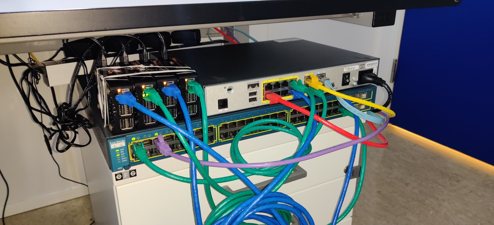

# Homelab
I 've setup these devices at my office as I have some physical equipment to work with, rather than the packet tracer :).

* Cisco 1811 - Router
* Cisco 2950 - Switch
* 4x Raspberry Pi's 3B
* 1x Lenovo Thinkpad T490

## **Description**
### **Router**
* **FE0/1**
	* UiA WAN
* **FE0/0**
	* LAN (Into Port1 on Switch)
* **Raspi 1,2 (from left)**
	* Port 2
	* Port 6
* **Console**
* **Laptop (Red)**
	* Port 5

### **Switch**
* **Raspi 3,4**
	* Port 47
	* Port 48
* **Console**
* **Laptop (Purple)**
	* Port 5

