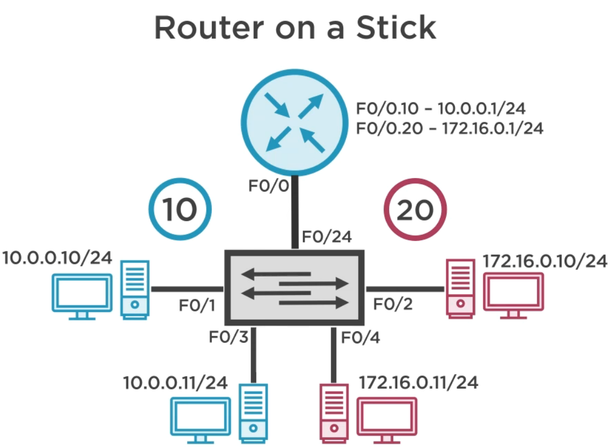

# InterVLAN Routing
```
   [Router]
      ||
      ||
  {Trunk Link}
       |
       |
    [Switch]
 10 / \ / \ 20
    "nodes"
```

## Router on a stick
> One Cable from our router to a switch

```S
   [Router]
      ||
      ||
  {Trunk Link}
```

### Configure

Things are getting complicated so no ascii art :(

* Switch 1
```
en
conf t
int f0/1 
switchport mode trunk
switchport mode trunk allowed vlan 10,20
```

* RouterA
```
en
conf t
int f0/0
no shut
int f0/0.10

encapsulation dot1Q 10
# to enable IEEE 802.1Q encapsulation of traffic on a specified subinterface

ip address 10.0.0.1 255.255.255.0
no shut

int f0/0.20
encapsulation dot1Q 20
ip address 172.16.0.1 255.255.255.0
no shut
exit
exit

show ip route
show ip int bri
```