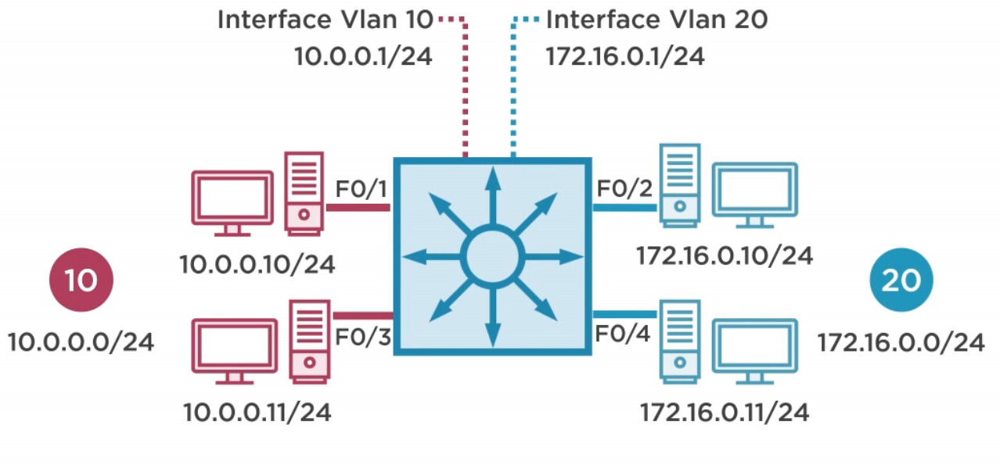

# Layer 3 Switch
> Combining the Router and  Layer 2 Switch

* Cisco Catalyst Swithc
  * Layer **2**
    * **2**950
    * **2**960
  * Layer **3**
    * **3**560
    * **3**750
    * **3**860
    * 4500, 6500, 6800

* SVI - Switched Virtual Interface
  * Acts like the Default Gateway for the VLAN's

## Configuring Layer 3 Switch
### Example


```
en
conf t 
ip routing # enables routing features on the switch
int vlan 10
ip adddress 10.0.0.1 255.255.255.0
no shut
exit

int vlan 20
ip address 172.16.0.1 255.255.255.0
no shut
exit
exit
show ip route


```